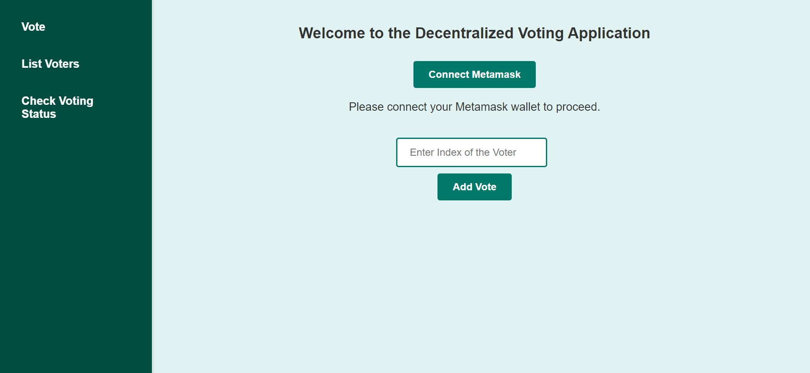

# Decentralized-Voting-Application

A decentralized voting application built using Solidity, Hardhat, and Ethereum blockchain. The project ensures a transparent and secure voting process where votes are stored immutably on the blockchain, providing trust and security.

## Features
- **Secure Voting:** All votes are securely stored on the Ethereum blockchain using a smart contract.
- **Immutable Results:** Once votes are cast, they cannot be altered or tampered with.
- **Transparency:** Anyone can verify the election results directly from the blockchain.
- **One Vote per User:** Each voter can vote only once, enforced by the smart contract logic.
- **Simple Interface:** A user-friendly interface for casting votes.

## Tech Stack
- **Smart Contracts:** Solidity
- **Blockchain Development Framework:** Hardhat
- **Frontend:** JavaScript, HTML, CSS
- **Blockchain:** Ethereum (via Volta network)
- **Backend:** Node.js
- **Frameworks & Libraries:** 
  - Web3.js for interacting with the blockchain
  - Hardhat for smart contract development and testing

## Requirements
Before starting, make sure you have the following installed:
- Node.js
- Hardhat (for compiling and deploying smart contracts)
- Metamask extension in your browser for interacting with the blockchain

## Installation

1. Clone the repository:
    ```bash
    git clone https://github.com/pranjalgautam11/Decentralized-Voting-Application.git
    cd Decentralized-Voting-Application
    ```

2. Install the dependencies:
    ```bash
    npm install
    ```

3. Metamask and Private Key generation
- Refer this video for setting Metamask https://youtu.be/ThKW18ZZalg?si=lyaGym8mJPVSBoVU 

3. Compile the smart contracts:
    ```bash
    npx hardhat compile
    ```

4. Deploy the smart contracts to the Volta test network or a local Ethereum node (using Hardhat's local node):
    ```bash
    npx hardhat run --network volta scripts/deploy.js
    ```
    copy the smart contract generated and paste in the .env and main.js file.

5. Launch the Node.js server:
    ```bash
    node server.js
    ```

6. Open your browser and connect to your local blockchain or the Volta test network using Metamask.

## Usage

1. **Create an Election:** The contract owner can create a new election by specifying the list of candidates.
2. **Cast a Vote:** Registered users can vote for a candidate of their choice.
3. **Check Results:** Once the voting period is over, the contract will automatically publish the results.

## Smart Contract Overview

The voting system's logic is written in Solidity and deployed on the Ethereum blockchain. The smart contract includes the following functionalities:
- **Election Creation:** Allows the administrator to set up a new election and define the candidates.
- **Voting:** Each eligible user can vote once for their chosen candidate.
- **Result Calculation:** After the election ends, the results are calculated and stored on the blockchain for transparency.

## Dashboard

